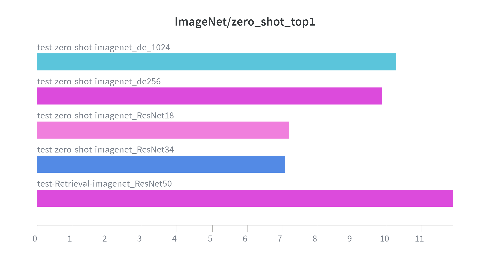
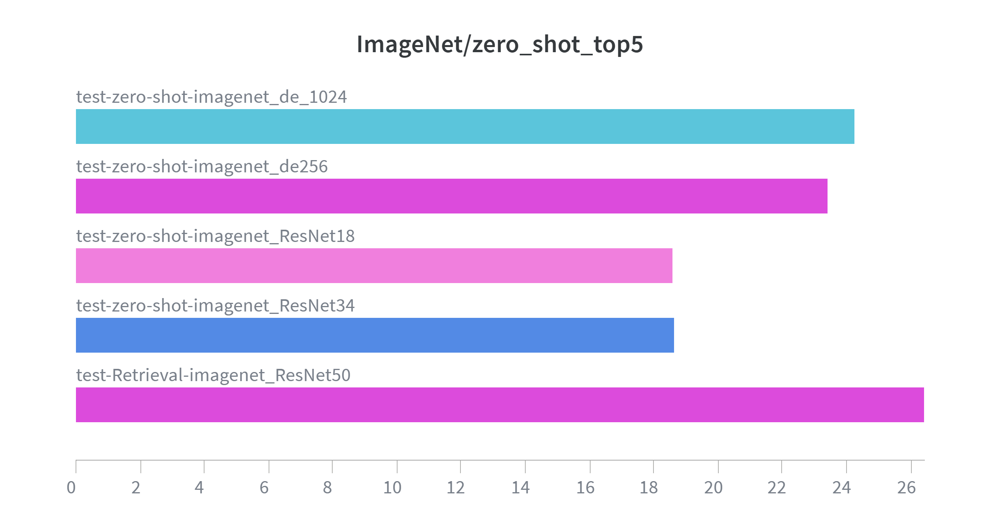

# CLIP (Contrastive Language-Image Pre-training) Implementation

This implements Contrastive Language-Image Pre-training (CLIP), trained on the Flickr30k dataset and evaluated through ImageNet-1K Zero-shot Classification. It explores the impact of model scaling and embedding dimensionality on multimodal alignment.

## Table of Contents

1. [Project Overview](#project-overview)
2. [Architecture](#architecture)
3. [Implementation Details](#implementation-details)
    - [Data Augmentation](#data-augmentation)
    - [Training Strategy](#training-strategy)
    - [Hyperparameters](#hyperparameters)
4. [Training Progress](#training-progress)
5. [Experimental Results](#experimental-results)
    - [Flickr30k Zero-shot Transfer](#flickr30k-zero-shot-transfer)
    - [ImageNet-1K Zero-shot Transfer](#imagenet-1k-zero-shot-transfer)
    - [Flickr30k Retrieval Task](#flickr30k-retrieval-task)
    - [Image-to-Text Search Example](#image-to-text-search-example)
6. [Extra Study: Model Scaling & Embedding Space](#extra-study-model-scaling--embedding-space)
    - [Effect of Visual Backbone Scaling](#effect-of-visual-backbone-scaling)
    - [Impact of Multimodal Embedding Dimension](#impact-of-multimodal-embedding-dimension)

## Project Overview

- **Objective:** Learning visual concepts from natural language supervision by aligning image and text embeddings in a shared latent space.
- **Methodology:** Utilizing Weight Transplantation from pretrained ResNet50 and CLIP-Text models to boost learning efficiency and performance.
- **Key Success:** Achieved significant zero-shot transfer capabilities on unseen datasets (ImageNet-1K).

[Back to Top](#table-of-contents)

---

## Architecture

The model consists of two separate encoders mapped to a joint multimodal embedding space via learnable projection heads.

- **Image Encoder:** ResNet50 (Pretrained on ImageNet).
- **Text Encoder:** Transformer-based encoder (Pretrained CLIP-Text).
- **Projection Heads:** Two separate linear layers ($2048 \to 512$) for image and ($512 \to 512$) for text features, followed by L2 normalization.
- **Similarity Metric:** Scaled cosine similarity with a learnable temperature parameter $\tau$.

[Back to Top](#table-of-contents)

---

## Implementation Details

To ensure high-fidelity reproduction, the training pipeline follows the core settings described in the origianl CLIP paper:

### Data Augmentation

I applied the exact transformation logic used in the paper to maintain visual consistency and robustness:

- **RandomResizedCrop**: Using a scale of `(0.9, 1.0)` to focus on core object features, resized to **224x224**.
- **Interpolation**: **BICUBIC** mode was used for higher-quality image resampling.
- **Normalization**: Standard ImageNet mean and deviation were applied.

### Training Strategy

- **Optimization**: AdamW optimizer with weight decay of 0.01.
- **Learning Rate Scheduler**: **Cosine Annealing with Warmup** was implemented to stabilize early training and ensure smooth convergence.
- **Early Stopping**: Monitored validation loss to prevent overfitting and save the best-performing weights.
- **Learnable Temperature**: The contrastive loss uses a learnable temperature $\tau$, initialized at **0.07** ($ln(1/0.07) \approx 2.659$).

### Hyperparameters

| Parameter | Value | Reference |
| :---: | :---: | :---: |
| Optimizer | AdamW | ($lr = 2 \times 10^{-5}$, weight decay $=0.01$) |
| Batch Size | 96 | - |
| Scheduler | Cosine Annealing | with Warmup Steps |
| Early Stopping | Enabled | Based on val loss |
| Interpolation | BICUBIC | OpenAI CLIP standard |
| Temperature $\tau$ | Learned | Initial $\tau = 0.07$ |

### Training Progress

The model was trained for 30 epochs using a contrastive objective. The loss decreased steadily, showing rapid convergence within the first 10 epochs.

[Back to Top](#table-of-contents)

---

## Experimental Results

### Flickr30k Zero-shot Transfer  

  

| Metric | Result |
| :---: | :---: |
| Top-1 Accuracy | 42.05% |
| Top-5 Accuracy | 82.11% |  

### ImageNet-1K Zero-shot Transfer  

Evaluated on the ImageNet validation set (50,000 images) without any fine-tuning on ImageNet labels.  

  

| Metric | Result |
| :---: | :---: |
| Top-1 Accuracy | 11.88% |
| Top-5 Accuracy | 26.42% |

> For 1000 classes, the model performs **118x better than random guess (0.1%)**, demonstrating successful zero-shot knowledge transfer.

### Flickr30k Retrieval Task  

Evaluating the model's ability to find corresponding pairs in the Flickr30k test set.

| Task | Recall@1 | Recall@5 | Recall@10 |
| :---: | :---: | :---: | :---: |
| Image-to-Text | 29.98% | 58.13% | 70.18% |

### Image-to-Text search Example

Here is a real example of the model performing an Image-to-Text search from the Flickr30k test set.  
The model successfully identifies the key subjects and actions in the query image.

| Query Image | Top 5 Predicted Captions |
| :---: | :--- |
|  | 1. **(Matched)** A person in a blue and white baseball uniform is standing on one foot while holding a bat .   2. Man playing for a baseball team with a blue protective hat and baseball uniform , playing for South Carolina , is swinging the bat and missing the ball .   3. The guy is in a baseball uniform , in a baseball field , and is throwing a baseball   4. A baseball pitcher on the mound in a black , green and white uniform prepares to release his pitch .   5. A baseball pitcher wearing a purple and white uniform throwing a baseball from the mound . |

[Back to Top](#table-of-contents)

---

## Extra Study: Model Scaling & Embedding Space

### Visualizing the Scaling Trends

| ImageNet Top-1 Comparison | ImageNet Top-5 Comparison |
| :---: | :---: |
|  |  |

### Effect of Visual Backbone Scaling

To analyze how the capacity of the Image Encoder affects performance, I compared **ResNet18, ResNet34, and ResNet50.**

#### Quantitative Comparison

While all models performed similarly on the **Flickr30k** test set (the training domain), there was a clear performance gap in the **ImageNet-1K Zero-shot** task (unseen domain).

| Backbone | Flickr30k Top-1 | ImageNet-1K Top-1 | Flickr30k Top-5 | ImageNet-1K Top-5 | Training Epochs |
| :--- | :---: | :---: | :---: | :---: | :---: |
| **ResNet50** | 42.05% | **11.88%** | **82.11%** | **26.42%** | 30 |
| **ResNet34** | **42.25%** | 7.10% | 81.07% | 18.63% | 10 |
| **ResNet18** | 41.21% | 7.20% | 81.98% | 18.60% | 10 |

#### Analysis & Insights

- **In-domain Efficiency:** On the Flickr30k dataset, the lighter models (ResNet18, ResNet34) achieved competitive results, with ResNet34 even slightly outperforming ResNet50,. This suggests that for smaller datasets like Flickr30k, smaller backbones provide sufficient representation power with less overfitting risk.
- **Zero-shot Generalization:** In the ImageNet Zero-shot task, a clear scaling trend was observed ($50 > 34 > 18$). This proves that larger model capacity is essential for capturing complex, high-level visual concepts that can be generalized to unseen datasets.
- **Convergence Speed:** Even with only 10 epochs of training, ResNet18 and 34 showed rapid convergence, proving that weight transplantation effectively initializes the multimodal embedding space.

### Impact of Multimodal Embedding Dimension

To investigate how the bottleneck of the joint latent space affects alignment, i experimented with different **Embedding Dimension ($d_e$)** using the **ResNet34** backbone.

#### Quantitative Comparison

All models were trained for 10 epochs to observe early-stage convergence and representation efficiency.

| Embedding Dim ($d_e$) | Flickr30k Top-1 | ImageNet-1K Top-1 | Flickr30k Top-5 | ImageNet-1K Top-5 |
| :---: | :---: | :---: | :---: | :---: |
| **256** | **42.76%** | 9.87% | 81.85% | 23.39% |
| **512** | 42.05% | **11.88%** | **82.11%** | **26.42%** |
| **1024** | 41.93% | 10.26% | 79.91% | 24.23% |

#### Analysis & Insights

- **The Information Bottleneck ($d_{e} = 512$ as the Sweet Spot):** increasing the embedding dimension to 1024 resulted in a performance degradation in both Flickr30k and ImageNet tasks compared to 512. This indicates that 512 dimensions provide the optimal information bottlenect for the Flickr30k dataset size. Beyond this point, the embedding space becomes too sparse, leading to sub-optimal alignment between visual and textual features.
- **Robustness of Compressed Embedding ($d_{e} = 256$):** Even with the dimension halved to 256, the model maintined a respectable 9.87% Top-1 Accuracy on ImageNet. This suggests that the core semantic features can be represented in a relatively compact space.
- **Domain-Specific Sensitivity:** The performance gap between dimensions was more significant in the ImageNet Zero-shot task than in the Flickr30k task. This reinforces the idea that higher-quality, well-dimensioned latent spaces are critical for out-of-domain generalization, whereas in-domain tasks are less sensitive to the exact dimensionality of the joint space.

[Back to Top](#table-of-contents)

---
