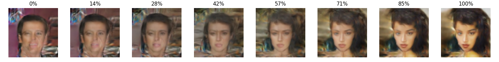
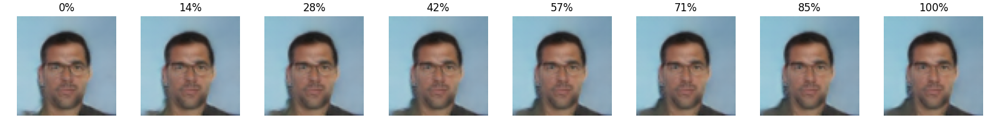

# DCGAN

This implements a Deep Convolutional Generative Adversarial Network (DCGAN) to generate realistic human faces using the CelebA dataset.  

## Progressive Face Generation

| Epoch 1 | Epoch 5 | Epoch 10 |
| :---: | :---: | :---: |
|  |  |  |

| Epoch 15 | Epoch 20 |
| :---: | :---: |
|  |  |  

## latent space Exploration

One of the most fascinating parts of GANs is manipulating the latent vector $z$.  

### Latent Interpolation (Z-Interpolation)

- Moving from one point to another in the latent space shows smooth transitions between faces.  
- It proves the model hasn't just memorized the data byt has learned a continuous representation.  

### Feature Manipulation  

- Changing specific dimensions of $z$ leads to variations in attributes (e.g., expression, or lighting, ...)

## Hyperparameters  

- **Optimizer:** AdamW ($lr=0.0002, \beta_1=0.5, \beta_2=0.999$)
- **Batch Size:** 128
- **Latent Dimension:** 100
- **Loss Function:** BCEWithLogitsLoss  
Instead of using a separate Sigmoid layer, i used `torch.nn.BECWithLogitsLoss()`, because it combines a `Sigmoid` layer and the `BCELoss` in one single class.  
This version is more numerically stable than using a plain `Sigmoid` followed by a `BCELoss` as, by combining the operations into one layerz it takes advantage of the log-sum-exp trick for numerical stability.  
- **Scheduler:** Cosine Annealing  
