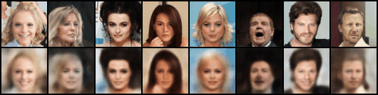
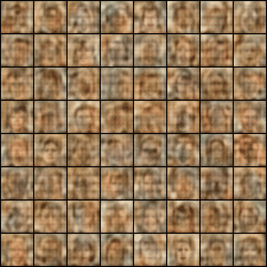

# VAE

This impolement a Variational AutoEncoder based on the architecture inspired by DCGAN.  
It captures the latent distribution of faces from the CelebA dataset.  

## Result

> The animations below show the progress from Epoch 1 to 50, with frame captured every **5 epochs**

### Reconstruction Quality

- **Top row:** Original images from the dataset.  
- **Bottom row:** Reconstructed images from the latent space.  
- It demonstrates how well the model encodes and deocdes specific facial features.  

### Latent Space Generation

- These images are generated by smapling from a **fixed latent noise** ($z \sim \mathcal{N}(0,1)$).  
- Watch how the model learns to map random noise to realistic human faces over time.

### Model Highlights

- **Architecture:** DCGAN-based Convolutional Encoder/Decoder  
- **Loss Function:** MSE (Reconstruction) + KL divergence (Regularization)  
- **Beta Annealing:** Lienar scheduling from 0 to 1 over the first 25 epochs.  
